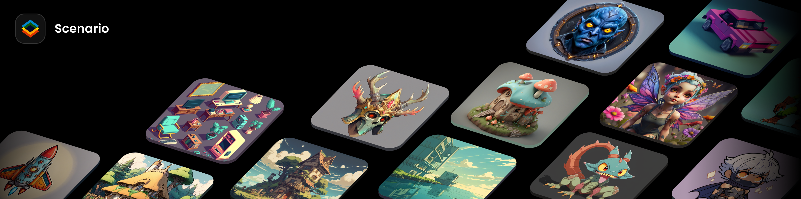

# Scenario Unity Plugin

🎉 Welcome to the Scenario Unity Plugin Open Source Project! 🎉

We are thrilled to welcome you to our innovative endeavor. This plugin stands at the crossroads of creativity and technology, uniting Unity developers and AI-powered game asset generation via [Scenario.com's unique API](https://docs.scenario.com/docs).

The Scenario Unity plugin simplifies asset creation, directly within the Unity Editor. It integrates seamlessly with your generators, enabling all Scenario features to be accessed directly within Unity. There's no more need to juggle between different platforms!

Whether you're an expert Unity developer or just venturing into the world of game development, your insights are valuable. We invite you to explore the code, provide [feedback](https://github.com/scenario-labs/Scenario-Unity/issues), submit [pull requests](https://github.com/scenario-labs/Scenario-Unity/pulls), or use the project to learn and grow.

With an open dialogue and shared passion for innovation, we look forward to the outstanding contributions we can make to the gaming community together. Let's redefine asset creation, and happy coding!

Learn more about Scenario on our [website](https://scenario.com/).

## Installation

Please review documentation [here](https://help.scenario.com/installing-the-unity-plugin).

## License

Review the [license](LICENSE) for this project.
